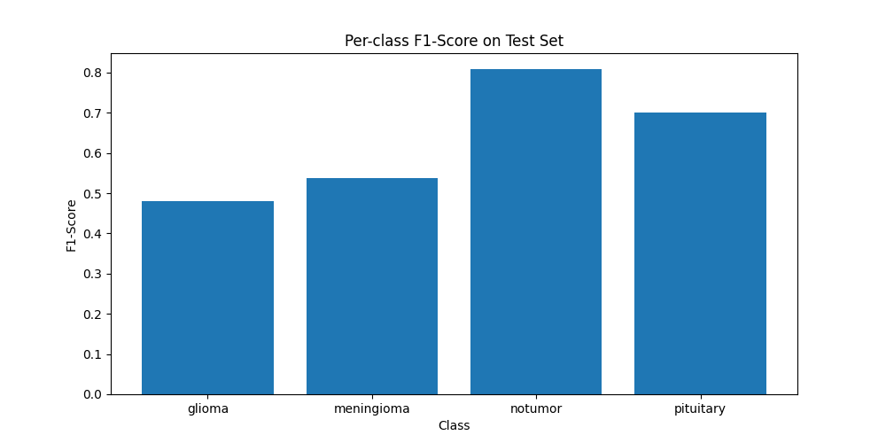

# DVS-Vision-Language-Model

# Brain Tumor Classification Using CLIP

## 📖 Project Overview
This project focuses on classifying MRI scans into four categories—`glioma`, `meningioma`, `notumor`, and `pituitary`—using a fine-tuned CLIP model (`clip-vit-base-patch32`). We leverage CLIP's vision-language capabilities to combine MRI images with descriptive captions, enabling the model to learn meaningful representations for classification. The project was developed as part of the *Design of Visual Systems* course at Imperial College London.

### Key Achievements
- Fine-tuned the CLIP model on the Brain Tumor MRI dataset for 2 epochs.
- Implemented data augmentation (random horizontal flips and rotations) to enhance model generalization.
- Logged training and evaluation metrics, including per-class accuracy, precision, recall, and F1-score.
- Generated comprehensive visualizations to analyze model performance, such as training loss, training vs. test accuracy, per-class accuracy, per-class F1-score, and confusion matrix.
- Saved the fine-tuned model weights for reproducibility.
- Explored morphological operations to understand their potential application in preprocessing MRI images (see the Morphological Operations section below).

---

## 🚀 Setup and Installation

### Prerequisites
- Python 3.8+
- A Mac M1 or compatible device (CPU/GPU support for PyTorch)
- Git installed for cloning the repository

### Installation Steps
1. **Clone the Repository**:
   ```bash
   git clone <repository-url>
   cd brain-tumor-classification

   
2. **Set Up the Virtual Environment**:

Create and activate a virtual environment, then install the required dependencies:
python -m venv vlm_env
source vlm_env/bin/activate
pip install -r requirements.txt


3. **Download the Dataset**:

- Download the Brain Tumor MRI dataset from [Kaggle](https://www.kaggle.com/datasets/masoudnickparvar/brain-tumor-mri-dataset).
- Place the dataset in a folder named `brain_tumor_data` at the same level as the repository, with the following structure:


This script will:
- Train the CLIP model for 2 epochs.
- Evaluate the model on the test set.
- Generate the following outputs in the `code` folder:
  - `model_weights.pth`
  - `training_metrics.json`
  - `evaluation_metrics.json`
  - Visualization PNGs (moved to `assets` for the repository)

### Code Structure

The project code is within the file

- `train_vlm.py`
- This code does the following--
- Defines the `MRIDataset` class and a custom collation function.
- Implements the training loop and saves training metrics.
- Evaluates the model and calculates per-class metrics.
- Generates visualizations (training loss, accuracy plots, confusion matrix).
- Orchestrates the entire pipeline (training, evaluation, visualization).
- `model_weights.pth`: The fine-tuned model weights (~600MB, available upon request as too large to upload to Github).
- `training_metrics.json`, `evaluation_metrics.json`: Saved metrics are save on this repository.

## Task 2: Model Evaluation and Results

### Overview of Performance

After training the CLIP model for 2 epochs, we achieved an overall test accuracy of 65.83%. Below are the detailed metrics, visualizations, and a comprehensive analysis of the model’s performance.

### Detailed Metrics

- **Overall Test Accuracy**: 65.83%
- **Per-class Accuracy**:
  - `glioma`: 33.00% (99/300)
  - `meningioma`: 55.88% (171/306)
  - `notumor`: 77.28% (313/405)
  - `pituitary`: 93.33% (280/300)
- **Per-class Precision, Recall, F1-Score**:
  - `glioma`:
    - Precision: 0.8761
    - Recall: 0.3300
    - F1-Score: 0.4794
  - `meningioma`:
    - Precision: 0.5198
    - Recall: 0.5588
    - F1-Score: 0.5386
  - `notumor`:
    - Precision: 0.8459
    - Recall: 0.7728
    - F1-Score: 0.8077
  - `pituitary`:
    - Precision: 0.5611
    - Recall: 0.9333
    - F1-Score: 0.7009

### Visualizations

We generated several visualizations to analyze the model’s performance:

<p align="center">  </p>

The training loss fluctuates between 1.0 and 5.0, with a general downward trend but significant variability, ending at 2.2812. This indicates the model hasn’t fully converged after 2 epochs.

<p align="center">  </p>

Training accuracy increases from 34.21% (epoch 1) to 57.76% (epoch 2), while test accuracy is 65.83%, suggesting good generalization but potential underfitting.

<p align="center">  </p>

The model performs best on `pituitary` (93.33%) and `notumor` (77.28%), but struggles with `meningioma` (55.88%) and `glioma` (33.00%).

<p align="center">  </p>

F1-scores reflect the accuracy trends: `notumor` (0.8077), `pituitary` (0.7009), `meningioma` (0.5386), and `glioma` (0.4794). The low F1-score for `glioma` is due to its low recall (0.3300).

<p align="center">  </p>

The confusion matrix shows significant misclassification for `glioma` (96 as `meningioma`, 105 as `pituitary`) and `meningioma` (52 as `notumor`, 74 as `pituitary`).

### Comment on the Results

The model excels at identifying `pituitary` and `notumor`, likely due to their distinct features, but struggles with `glioma` and `meningioma` due to visual similarities with other classes. The test accuracy (65.83%) being higher than the training accuracy (57.76%) indicates good generalization, but the high training loss and limited epochs (2) suggest underfitting. Class imbalance (`notumor` has 405 test samples, others have 300-306) may also bias the model toward `notumor` and `pituitary`. Training for more epochs and addressing class imbalance could improve performance.

